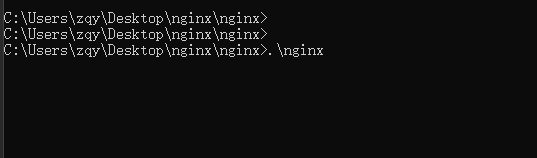

# 1.开发模式运行

```shell
npm run dev
```
---

# 2.项目打包

```shell
npm run build
```
---

# 3.预览本地构建

```shell
npm run preview
```
---

# 4.生产环境下运行

### 4.1 修改nginx.conf 的 http.server.location.root


### 4.2 下载nginx到本地
- 下载链接如下
- [http://nginx.org/download/nginx-1.22.1.zip](http://nginx.org/download/nginx-1.22.1.zip)
- 解压后如图
- 

### 4.3 将刚刚修改的nginx.conf替换下载nginx目录里面的conf/nginx.conf


### 4.4 从nginx主目录打开cmd,输入以下命令

```shell
.\nginx
```


---
- 如果没有报错,说明运行成功

- 浏览器进入连接即可 [http://localhost:8888](http://localhost:8888)

### 4.5 默认端口8888,自定义端口

- 修改项目目录下面的nginx.conf, 修改项如图

- 修改后，重新复制项目里面的nginx.conf,替换nginx目录里面的/conf/nginx.conf文件
- 在nginx主目录打开一个cmd，输入以下命令
```shell
# 若nginx服务正在运行，进行重新运行
.\nginx -s reload

# 若nginx服务已经停止运行
.\nginx
```
- 运行命令后没有报错，则运行成功, 可以用浏览器打开对了连接，进行访问

---
### 4.6 如果需要停止nginx服务,(一定不要直接吧cmd窗口关掉！！！),应该在nginx主目录新建一个cmd窗口，输入以下命令

```shell
.\nginx -s stop
```
